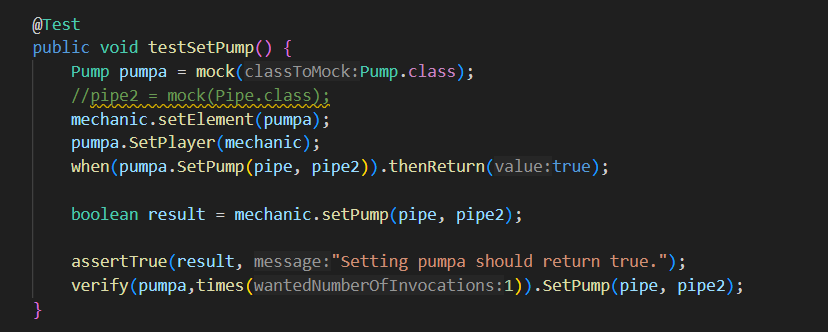
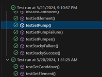

JUnit tests are a popular framework for unit testing in the Java language. They allow you to test individual classes or methods in isolation, ensuring the quality and reliability of your code. Mock objects, the when keyword, and the verify keyword play key roles in writing effective JUnit tests.

Mock objects:

Mock objects are objects that simulate the behavior of another object. They can be useful for testing dependencies that are difficult to configure or access in the test environment. Mock objects can be configured to respond to calls in a predetermined way, allowing you to verify the behavior of the code under test.

The when keyword:

The when keyword is used to configure the behavior of mock objects. With this keyword, you can specify how the mock object should respond to a given input. For example, you can set up a mock object to return a specific value when a particular method is called.

The verify keyword:

The verify keyword is used to verify interactions with mock objects. With this keyword, you can check that the code under test called the mock objects in the expected way. For example, you can verify that the code under test called a particular method on the mock object, and that it called it with the correct arguments.

My part:

In my work, I used the above mentioned to write tests. For example, I wrote a test like this. 

Mechanic is placed on a Pump element (mocked). Mock the Pumpa.SetPump method to return true (successful pump placement). Call the mechanic's setPump method with two pipes. Assert that the method returns true indicating successful pump placement. Verify that the Pump.SetPump method was called once with the provided pipes.

The image below shows that the test was successful:

