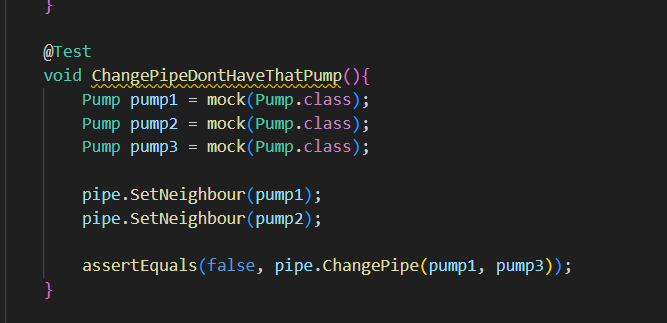
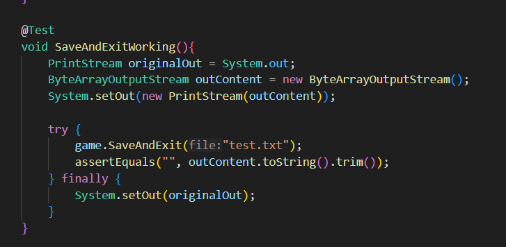

My task was to make Unit test for Pipe.java and Game.java class. I tried to achieve the best possible code coverage. Firstly, I tested the simple methods where there was no need to use a mock object. Then I also did the more serious tests, during which the mock objects had to be used. Before every tests I create a new pipe or game object so they all start from the starting state. Unfortunately, due to the static attributes and functions of the PipeSystem, I could not use the mock perfectly, because the MockedStatic did not work even after many attempts, so I achieved the desired goal by slightly reorganizing the tests.

A test from Pipe.java:

In this picture you can see that I tested whether it is possible to switch the pump if the player does not have a pump in hand. And it is correct because the function returns false.

A test from Game.java:

In this picture you can see that I tested that does the function save the data without error.