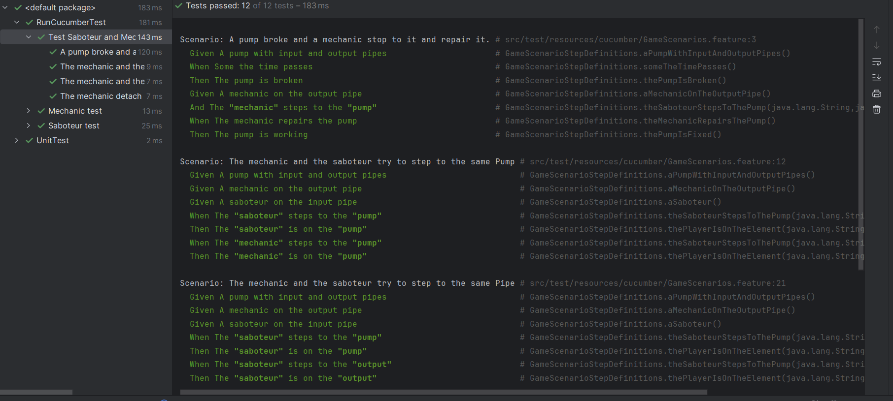

# Cucumber documentation

### What is Cucumber?

Cucumber is a popular open-source tool for Behavior-Driven Development (BDD). It allows teams to describe software behavior in plain language using a syntax called Gherkin. This makes it easier for developers, testers, and non-technical stakeholders to understand and collaborate on the specifications.

### Why did we decide to add it?

After a conversation with the team we decided to create BDD test for the project. However the code was already implemented, we found very useful this tool. With the help of Cucumber we were able to test game scenarios without launching the code and play through the scenarios manually. This way the testing was more efficient.

### How do you see the details / measures?

You can check the results after running the tests in the IDE.

### What was the aftermath of adding SonarCloud?

We discovered a few bugs in the game mechanism:

- When a player was already on a pump an other player was not ablo step to it. We fixed it, now more player can stand on a pump at the same time.

- There was issues with pump repairing also. These have been fixed.

- When a player stepped a slippery pipe and after that stepped a sticky pipe the player was able to move. We found the source this bug and fixed it

## Results:

We found this tool very useful. We were able to test the same game scenarios multiple times. What's more we got a report of the result of test and saw where the problem was. Running the test multiple times made easier to fix the found bugs.

