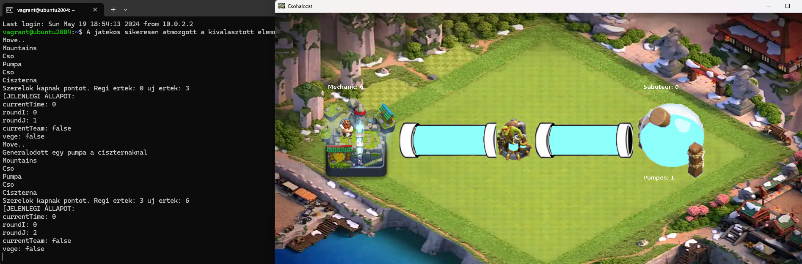

To make it work, you need:
- Vagrant
- A supported virtual machine (tested with VirtualBox, they also recommend it)
- For Windows, an X11 server (e.g., Xming)

To start:
1. Navigate to the directory where the Vagrantfile is located.
2. Run `vagrant up` (wait for the boot process to complete, may take 5-10 minutes).
3. Start an SSH session to the VM from the directory of the Vagrantfile: `vagrant ssh -- -X` (in PuTTY, enable X11 forwarding in by going to Connection -> SSH -> X11 and checking "Enable X11 forwarding").
4. If prompted, log in (username: vagrant, password: vagrant).
5. The game will start by default. If the X11 server is not running on your machine, start it and then run `bash /home/vagrant/check-and-start-java.sh` to start the game.

About: Setting up a Vagrant virtual machine for this project offers several benefits. Firstly, it allows for easy testing of the program in a Linux environment, ensuring compatibility across different operating systems. Additionally, the VM setup eliminates the need to install Java on the host machine, simplifying the process of playing the game without any additional dependencies. Furthermore, Vagrant enables testing the program with a specific JDK version (openjdk 11, with the current setup) required to play the game, even if the host machine doesn't have the correct version installed. With Vagrant, the setup process only takes a few minutes and the VM setup can be done with a few simple commands.

